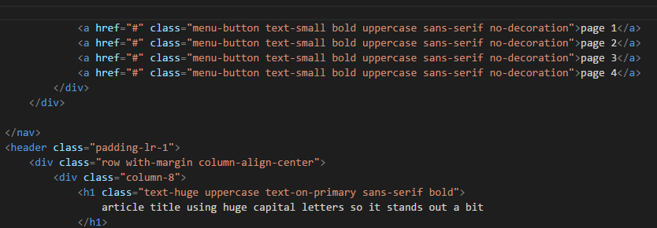

# Class autocomplete for HTML - README

Intelligent auto completion for HTML class="" attribute.

## Features

Extension automatically scans an active HTML file for external CSS style sheet links. When a style sheet is found class names are extracted and made available for use with code completion feature of Visual Studio Code.
-	Autocomplete contains only classes referenced in the current html document.
-	Class names are automatically updated every time you return to your HTML file after editing and saving your CSS.
-	Class names are also extracted from within media queries.
-	CSS file scanning can be started manually using command palette. Just execute the "Scan linked CSS files" command.

## Known Issues
-	Extension can take even over 30 seconds to generate a class list when used in conjunction with frameworks like Bootstrap, Foundation, Font Awesome etc. due to a large number of CSS classes.
-	Minified CSS may cause class list not to generate properly. (Please use uncompressed CSS for development.)

## Release Notes
### 0.1.0 
2016-07-28 Initial preview release.